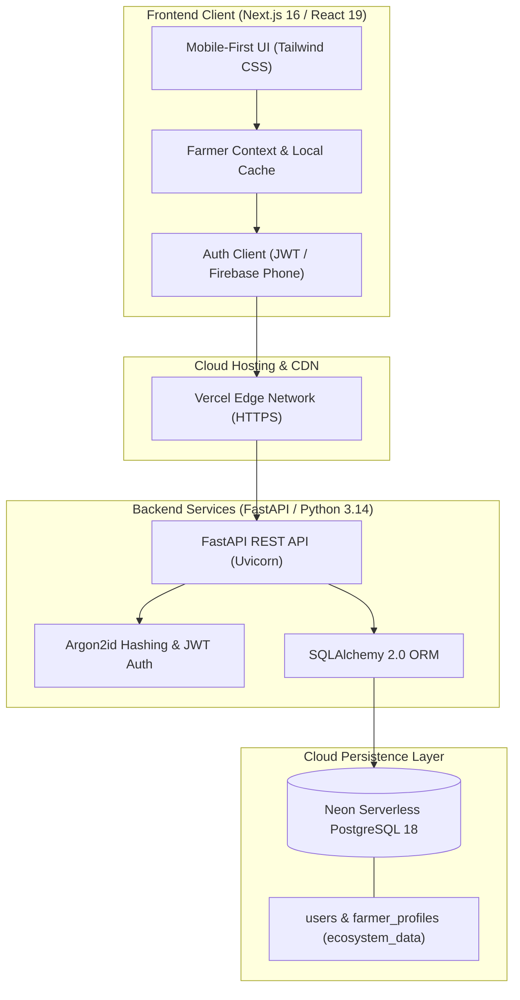
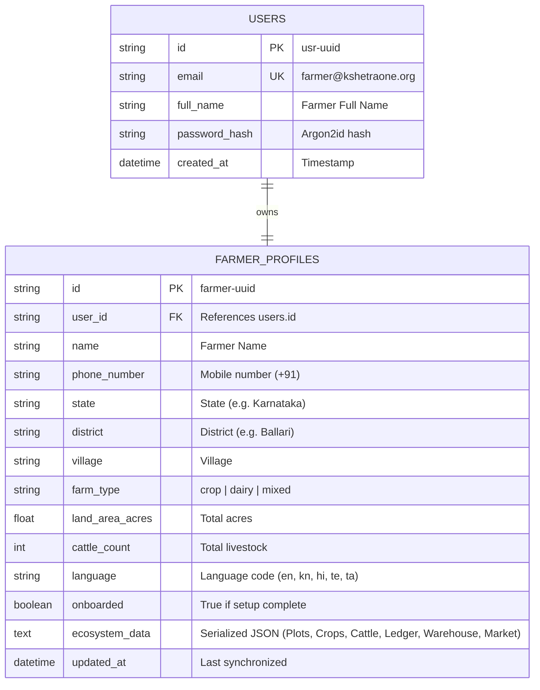

# KshetraOne — Technical Design & Architecture Document

## 1. Executive Summary

KshetraOne is an integrated rural operating platform engineered for Indian smallholder farming households practicing mixed agriculture and dairy livelihoods. It unifies farm management, livestock health, financial tracking, warehouse logistics, and local marketplace commerce into a responsive, mobile-first system.

---

## 2. High-Level System Architecture

---

## 3. Technology Stack

| Layer | Technologies | Purpose |
| :--- | :--- | :--- |
| **Frontend Framework** | Next.js 16.3.8 (App Router), React 19, TypeScript | Server and client rendered UI, responsive layout |
| **Styling & Design** | Tailwind CSS, Lucide React, Framer Motion | Agricultural green-themed mobile UI, accessible on all screen widths |
| **State & Offline Sync** | React Context API, LocalStorage cache | Offline-first availability for rural regions |
| **Backend API** | FastAPI (Python), Uvicorn ASGI Server | High-performance asynchronous REST API |
| **Authentication** | Argon2id password hashing, PyJWT signed tokens | Secure, independent zero-cost authentication |
| **Database ORM** | SQLAlchemy 2.0, Psycopg 3 binary driver | Scalable schema modeling and connection pooling |
| **Cloud Database** | Neon Serverless PostgreSQL 18 (AWS Ohio) | Fully persistent relational and serialized JSON storage |
| **Hosting & CI/CD** | Vercel (Frontend), Render (Backend) | Automatic HTTPS, global CDN, and zero-downtime deployment |

---

## 4. Database Schema Design

The persistence architecture uses a relational foundation paired with flexible schema support for dynamic agricultural records:

---

## 5. Security & ₹0 Budget Architecture

1. **Password Protection**: Raw passwords are never stored in plaintext. They are hashed using **Argon2id** (`m=65536, t=3, p=4`).
2. **Stateless JWT Authorization**: API requests use standard Bearer token authentication signed via HMAC SHA-256.
3. **₹0 Cost Protection**: 
   - No paid third-party SMS or email APIs.
   - Built on free-tier serverless PostgreSQL (Neon) and container services (Render & Vercel).
